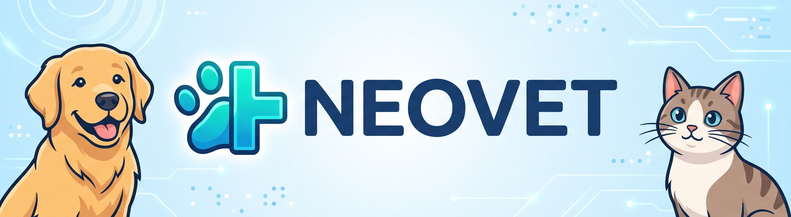
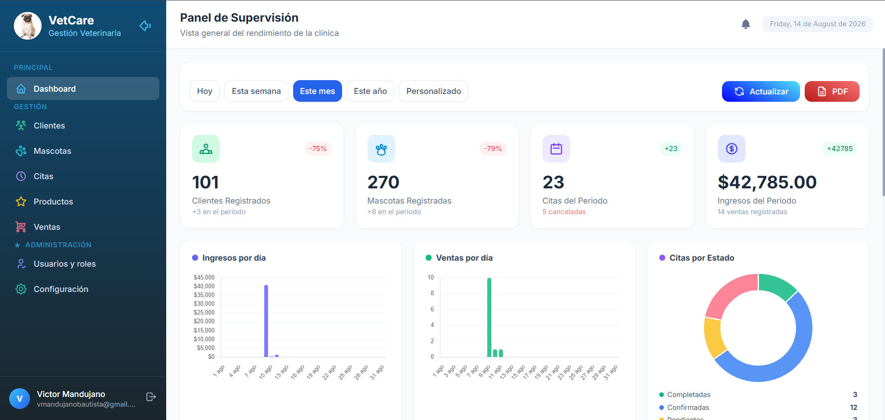
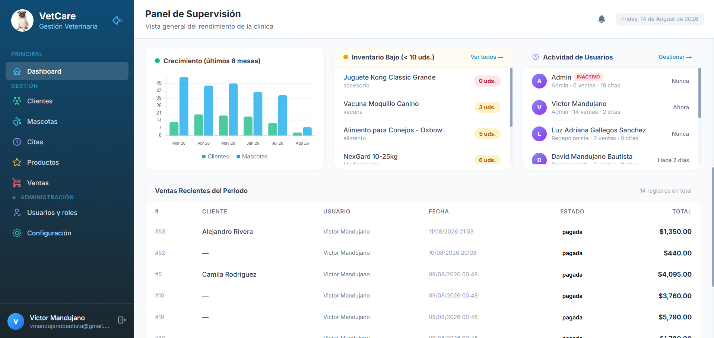
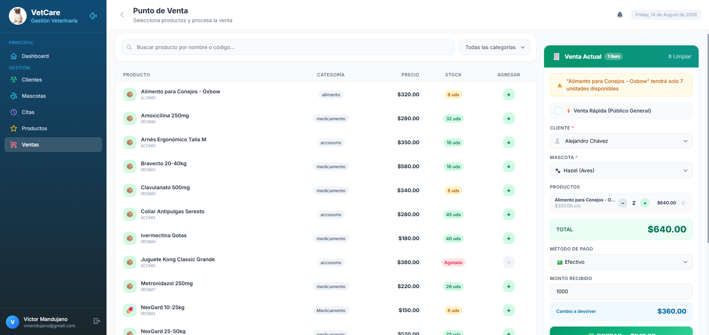
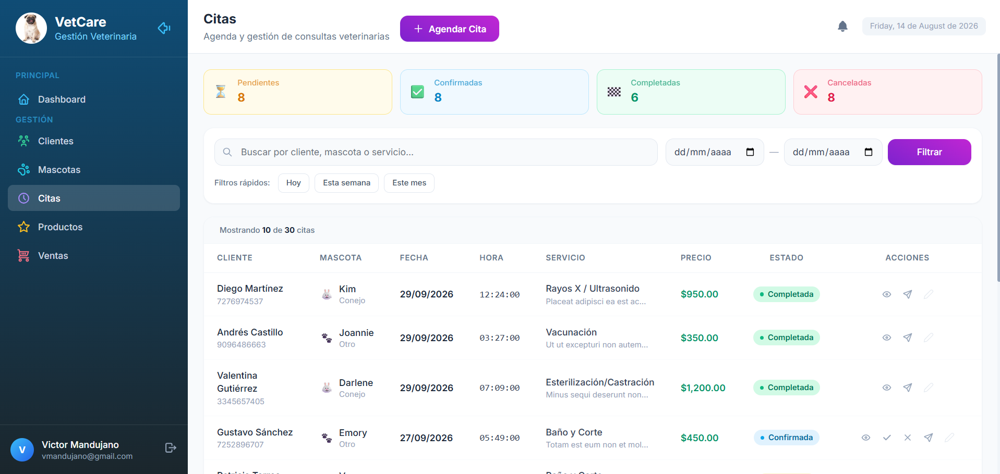
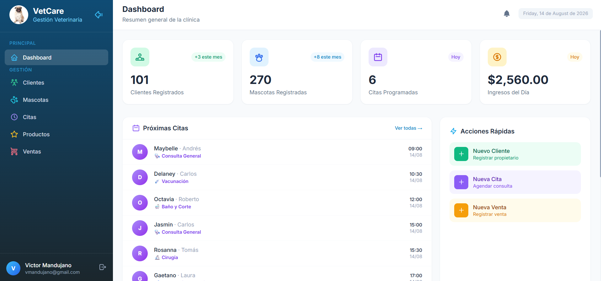
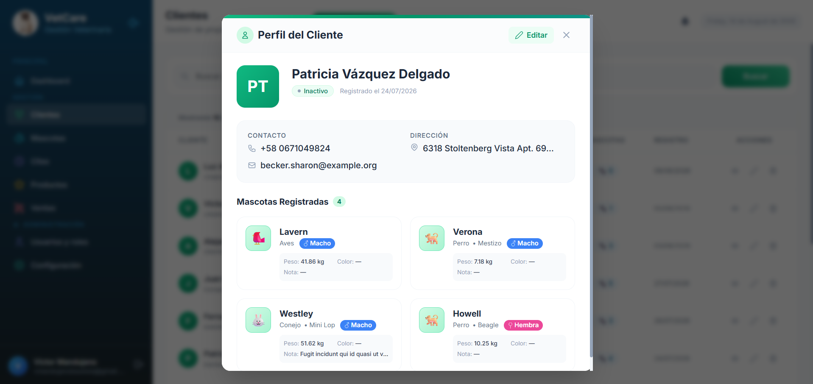

# NeoVet - Sistema de Gestión para Clínicas Veterinarias

> NeoVet consiste en una aplicación web desarrollada para la gestión y administración de una clínica veterinaria. El sistema permite centralizar la  información de los clientes, mascotas, citas, productos e inventario además, permite el registro de ventas realizadas en la clínica. 
> Destaca por su Control de Acceso Basado en Roles (RBAC) para administradores y recepcionistas, y un panel analítico diseñado para el monitoreo de ventas e inventario en tiempo real.


## 🛠️ Stack Tecnológico

<div align="center">
  <a href="https://php.net/"></a>
  <a href="https://laravel.com/"></a>
  <a href="https://www.mysql.com/"></a>
  <a href="https://tailwindcss.com/"></a>
  <a href="https://alpinejs.dev/"></a>
  <a href="https://vite.dev/"></a>
  <a href="https://nodejs.org/"></a>
  <a href="https://getcomposer.org/"></a>
  <a href="https://pusher.com/"></a>
</div>


## 📑 Tabla de Contenidos

- [Acerca del Proyecto](#-acerca-del-proyecto)
- [Características Principales](#-características-principales)
- [Arquitectura y Lógica de Negocio](#-arquitectura-y-lógica-de-negocio)
- [Guía de Instalación Local](#-guía-de-instalación-local)

---

## 📖 Acerca del Proyecto
NeoVet es una plataforma web creada para que las clínicas veterinarias organicen toda su operación en un solo lugar. Como herramienta moderna e intuitiva, ayuda al equipo a gestionar de forma rápida las historias clínicas de las mascotas, el control de la agenda médica, las ventas y el inventario. El sistema simplifica las tareas diarias del personal y segmenta los accesos según el puesto, garantizando que la atención al paciente y la administración financiera del negocio funcionen en perfecta sintonía.

## ✨ Características Principales
- **Sistema Integral de Roles de Usuario**: Acceso segmentado mediante Laravel Breeze. Los administradores tienen control total sobre inventarios y reportes, mientras que los recepcionistas gestionan citas e historiales.
- **Dashboard Analítico y Punto de Venta (POS)**: Interfaz transaccional para procesar ventas de mostrador, complementada con un panel de métricas que permite auditar el rendimiento comercial de la clínica.
- **Actualizaciones en Tiempo Real**: Integración robusta con WebSockets mediante Pusher y Laravel Echo. Las notificaciones, alertas de inventario bajo y actualizaciones de citas se reflejan instantáneamente sin recargar la página.
- **Transiciones y Experiencia Fluida**: Navegación dinámica implementada con Swup y animaciones con Motion, logrando una experiencia (UX) similar a una Single Page Application (SPA) con renderizado del lado del servidor.
- **Generación de Reportes**: Exportación automatizada de historiales clínicos, recetas médicas y reportes financieros en formato PDF utilizando Laravel DOMPDF.
  
## ⚙️ Arquitectura y Lógica de Negocio
El proyecto está construido sobre el ecosistema moderno de PHP utilizando el **TALL Stack** (Tailwind CSS, Alpine.js, Laravel y Livewire/Blade), estructurado de la siguiente manera:

- **Backend (Laravel 12 & PHP 8.2)**: Maneja toda la lógica de negocio, reglas de validación, enrutamiento seguro y autenticación, el sistema sigue el patrón MVC (Modelo-Vista-Controlador).
- **Base de Datos (MySQL)**: Actúa como la fuente central de verdad, gestionando relaciones complejas, el esquema es gestionado completamente a través de las migraciones y seeders de Laravel.
- **Frontend Interactivo**:
  - **Tailwind CSS** para un diseño responsivo, limpio y basado en componentes visuales utilitarios.
  - **Alpine.js** para manejar la interactividad del DOM, modales y validaciones del lado del cliente de forma ligera.
  - **Vite** orquestando la compilación y recarga en caliente de los recursos (assets).
- **Emisión de Documentos**: Cuando se requiere un reporte, el controlador recupera los datos de MySQL, renderiza una vista Blade específica y utiliza `barryvdh/laravel-dompdf` para convertir ese HTML en un archivo PDF descargable.

## 🚀 Guía de Instalación Local

1. **Clonar el repositorio**
   ```bash
   git clone https://github.com/tu-usuario/NeoVet.git
   cd NeoVet
   ```

2. **Instalar dependencias de PHP y Node.js**
   ```bash
   composer install
   npm install
   ```

3. **Configurar las variables de entorno**
   Copia el archivo de ejemplo para crear tu propio `.env`:
   ```bash
   cp .env.example .env
   ```
   *Nota: Abre el archivo `.env` y configura tus credenciales de base de datos (`DB_DATABASE`, `DB_USERNAME`, `DB_PASSWORD`) y las credenciales de Pusher (`PUSHER_APP_ID`, `PUSHER_APP_KEY`, `PUSHER_APP_SECRET`).*

4. **Generar la clave de la aplicación**
   ```bash
   php artisan key:generate
   ```

5. **Migrar y poblar la base de datos** (Ejecuta las migraciones y seeders de prueba)
   ```bash
   php artisan migrate:fresh --seed
   ```

6. **Compilar los assets del frontend y levantar el servidor de desarrollo**
   Puedes ejecutar ambos entornos simultáneamente. En una terminal ejecuta:
   ```bash
   npm run dev
   ```
   Y en otra terminal inicia el servidor de Laravel:
   ```bash
   php artisan serve
   ```

   *Opcional: Si tienes Pusher y Jobs configurados, recuerda iniciar el worker en una terminal extra:*
   ```bash
   php artisan queue:listen
   ```

7. **Acceder a la plataforma**
   Abre tu navegador web y visita: `http://localhost:8000`

## 💻 Demostración Visual del Sistema

<table align="center">
  <tr>
    <td align="center">
      <b>📊 Panel de Supervisión (KPIs)</b><br>
      
    </td>
    <td align="center">
      <b>📈 Inteligencia de Negocios y Auditoría</b><br>
      
    </td>
  </tr>
  <tr>
    <td align="center">
      <b>🛒 Punto de Venta (POS) Integrado</b><br>
      
    </td>
    <td align="center">
      <b>🗓️ Control de Agenda Médica</b><br>
      
    </td>
  </tr>
  <tr>
    <td align="center">
      <b>👥 Panel de Recepcionistas</b><br>
      
    </td>
    <td align="center">
      <b>🏥 Gestión de Pacientes y Clientes</b><br>
      
    </td>
  </tr>
</table>

## 🗺️ Próximos Pasos

### 🟢 Fase 1: Optimización y Experiencia de Usuario (Corto Plazo)
- [ ] **Calendario Interactivo Avanzado**: Integración visual tipo *drag-and-drop* para que los recepcionistas gestionen las citas de manera más intuitiva.
- [ ] **Notificaciones Push y SMS**: Envío de recordatorios automáticos de citas y vacunas a los clientes mediante SMS o WhatsApp usando APIs como Twilio.
- [ ] **Dashboard Analítico**: Implementación de gráficos dinámicos en el panel de administrador para visualizar productos más vendidos y rendimiento de la clínica.
- [ ] **Optimización de Consultas:** Refinamiento de *Stored Procedures* y *Triggers* para agilizar la carga del panel de métricas financieras.

### 🟡 Fase 2: Expansión Clínica y Médica (Medio Plazo)
- [ ] **Módulo de Vacunación y Desparasitación**: Alertas automáticas internas cuando una mascota requiere su próxima dosis según su historial clínico.
- [ ] **Gestión de Hospitalización**: Nuevo módulo para llevar el control de mascotas internadas, asignación de jaulas/camillas y seguimiento de signos vitales por turnos.
- [ ] **Anexos Multimedia en Historiales**: Capacidad para subir y almacenar de forma segura estudios de laboratorio, radiografías y fotografías del progreso clínico de las mascotas.
- [ ] **Machine Learning para Inventarios:** Implementación de modelos predictivos para anticipar la demanda de medicamentos según la temporada del año.
- [ ] **Despliegue en la Nube:** Configuración de la infraestructura en servidores cloud utilizando herramientas de virtualización como Dokploy en entornos Azure/Ubuntu.
      
### 🟠 Fase 3: Portal de Clientes y Finanzas (Largo Plazo)
- [ ] **Portal de Dueños de Mascotas**: Una vista externa y con acceso restringido donde los clientes puedan iniciar sesión para descargar recetas de sus mascotas, ver su historial de peso y solicitar nuevas citas.
- [ ] **Pasarela de Pagos**: Integración con plataformas de pago Stripe o PayPal para permitir el cobro de consultas por adelantado desde el portal de clientes.
- [ ] **Facturación Electrónica**: Generación y envío automático de facturas con validez fiscal.

## Autor 
**Victor Mandujano Bautista**  
Soy estudiante de Ingeniería en Sistemas Computacionales enfocado en el diseño de bases de datos relacionales, arquitecturas de software escalables (SaaS) y la integración de inteligencia de negocios en el desarrollo web.

* 🌐 **LinkedIn:** (www.linkedin.com/in/victor-mandujano-bautista)
* :octocat: **GitHub:** [@vmandujanobautista-beep](https://github.com/vmandujanobautista-beep)
* ✉️ **Email:** [vmandujanobautista@gmail.com]

---
*¡Gracias por tu interés! Si este proyecto te resultó útil o te pareció interesante, te invito a apoyarlo dejando una ⭐ en el repositorio.*
